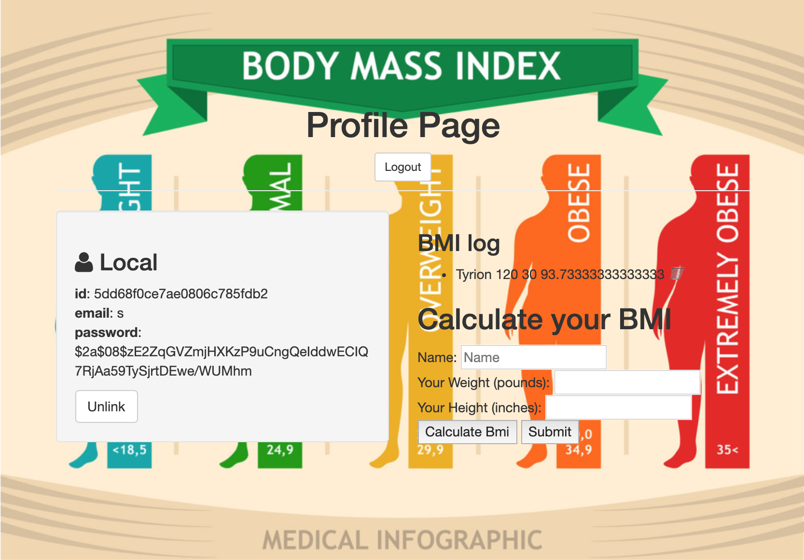

The goal of this project was to create a BMI calculator using mongoDB and Node JS. Explored CRUD principles in order to complete project.

## Installation

1. Clone repo
2. run `npm install`

## Usage

1. run `node server.js`
2. Navigate to `localhost:8080`

## Credit

Modified from Scotch.io's auth tutorial
